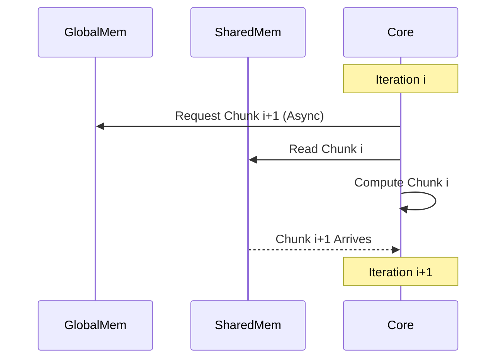

# Asynchronous Memory Copy (`cp.async`)

Asynchronous Memory Copy, introduced in CUDA Compute Capability 8.0 (Ampere), allows for loading data from Global Memory directly into Shared Memory without using intermediate registers and without blocking the execution thread. This enables efficient overlap of memory transfer and computation.

**Previous: [Memory Debugging](6_memory_debugging.md)** | **Next: [Synchronization Basics](../03_synchronization/1_synchronization_basics.md)**

---

## Why Async Copy?

In older architectures (Volta, Pascal), loading data from Global to Shared Memory involved:
1.  Load from Global Memory to Register.
2.  Store from Register to Shared Memory.
3.  Wait for completion.

This consumed register bandwidth and stalled the thread.

With `cp.async` (exposed via `cuda::memcpy_async` and `cuda::pipeline`):
1.  Issue copy instruction (Global -> Shared).
2.  Thread continues execution (can do other math).
3.  Thread waits (yields) only when data is strictly needed.

## The `cuda::pipeline` Interface

The C++ interface for async copy is provided by the `<cuda/pipeline>` header (requires C++20 or compatible NVCC settings).

### Basic Usage

```cpp
#include <cuda/pipeline>

__global__ void async_example(int* global, int* shared) {
    auto pipe = cuda::make_pipeline();

    // 1. Issue Copy
    pipe.producer_acquire();
    cuda::memcpy_async(shared, global, sizeof(int), pipe);
    pipe.producer_commit();

    // 2. Compute Independent Work
    // ... math that doesn't need 'shared' ...

    // 3. Wait for Copy
    pipe.consumer_wait();

    // 4. Use Data
    int val = *shared;
    pipe.consumer_release();
}
```

## Multi-Stage Pipelines

The real power of async copy comes when processing data in stages (e.g., a loop). You can fetch the *next* chunk of data while processing the *current* chunk.



### Pipeline Primitives

*   `producer_acquire()`: Prepare to issue new async operations.
*   `producer_commit()`: Mark the end of a batch of async operations.
*   `consumer_wait()`: Block until the specified batch is ready.
*   `consumer_release()`: Signal that we are done reading the buffer, freeing it for the next producer stage.

## Hardware Requirements

*   **Compute Capability**: 8.0 or higher (Ampere, Hopper, Blackwell).
*   **Compilation**: `-arch=sm_80` or higher.

## Code Example

A complete working example can be found in `src/02_memory_hierarchy/AsyncCopyDemo.cuh`.

```cpp
// src/02_memory_hierarchy/AsyncCopyDemo.cuh

// ... (Snippet from the file) ...
    pipe.producer_acquire();
    if (global_idx < n) {
        cuda::memcpy_async(&s_data[local_idx], &global_data[global_idx], sizeof(int), pipe);
    }
    pipe.producer_commit();

    pipe.consumer_wait();

    // Compute...

    pipe.consumer_release();
```

## Best Practices

1.  **Alignment**: Ensure pointers are aligned (ideally 16 bytes) for maximum bandwidth.
2.  **Pinned Memory**: Use `cudaHostAlloc` (pinned memory) for host buffers to ensure the transfers are truly asynchronous at the system level when involving host.
3.  **Warp Coalescing**: Even though `cp.async` is a thread-level API, it works best when the whole warp issues contiguous loads.

## Related Guides

*   **[Shared Memory](3_shared_memory.md)**
*   **[Global Memory](2_global_memory.md)**
