# Asynchronous Memory Copy (cp.async)

Asynchronous Memory Copy, introduced in NVIDIA Ampere architecture (Compute Capability 8.0), allows threads to initiate a copy operation from Global Memory to Shared Memory that is executed asynchronously by the hardware. This bypasses the register file and allows the SM (Streaming Multiprocessor) to perform other computations while data is being loaded.

**Previous: [Memory Debugging](6_memory_debugging.md)**

---

## **Why Asynchronous Copy?**

### Traditional Load (Synchronous)
1.  **Load**: Data flows from Global Memory → Registers.
2.  **Store**: Data flows from Registers → Shared Memory.
3.  **Wait**: The thread is stalled during the load (unless ILP is high).

### Asynchronous Load (`cp.async`)
1.  **Command**: Thread issues a "copy async" command.
2.  **Direct Transfer**: Hardware moves data Global Memory → Shared Memory (bypassing registers).
3.  **Compute**: Thread continues execution immediately.
4.  **Wait**: Thread synchronizes only when data is needed.

**Benefits:**
*   **Latency Hiding**: Overlap computation with memory transfer.
*   **Reduced Register Pressure**: Data doesn't consume registers.
*   **Bandwidth Efficiency**: Optimized hardware path.

---

## **The Pipeline Pattern**

The most common use case is a **multi-stage pipeline**, often used in matrix multiplications (GEMM) or convolution kernels. While the GPU computes on a tile of data in Shared Memory (Stage $N$), it simultaneously loads the next tile for Stage $N+1$.

```mermaid
gantt
    title Synchronous vs Asynchronous Pipeline
    dateFormat s
    axisFormat %s

    section Synchronous
    Load Tile 0   :a1, 0, 2
    Compute Tile 0:a2, 2, 3
    Load Tile 1   :a3, 5, 2
    Compute Tile 1:a4, 7, 3

    section Asynchronous
    Issue Load 0  :b1, 0, 0.1
    Wait Load 0   :b2, 0.1, 1.9
    Compute Tile 0:b3, 2, 3
    Issue Load 1  :b4, 2, 0.1
    Wait Load 1   :b5, 2.1, 1.9
    Compute Tile 1:b6, 5, 3
```


*(Note: In a real optimized pipeline, the "Issue Load" and "Wait" overlap perfectly with "Compute" of the previous stage, eliminating gaps.)*

---

## **Using `cuda::pipeline`**

CUDA C++ provides the `<cuda/pipeline>` header to manage asynchronous copies safely.

### **API Overview**

*   `cuda::pipeline<cuda::thread_scope_thread>`: Creates a pipeline object.
*   `cuda::memcpy_async(dest, src, size, pipe)`: Issues an async copy.
*   `pipe.producer_commit()`: Marks a batch of copies as "submitted".
*   `pipe.consumer_wait()`: Blocks until the specified batch is ready.

### **Code Example**

For a complete runnable example, see [`AsyncCopyDemo.cuh`](../src/02_memory_hierarchy/AsyncCopyDemo.cuh).

```cpp
#include <cuda/pipeline>

__global__ void async_pipeline_kernel(float* global_in, float* global_out) {
    extern __shared__ float shared_mem[];
    float* buffer = shared_mem;

    // Create a pipeline object
    cuda::pipeline<cuda::thread_scope_thread> pipe = cuda::make_pipeline();

    // 1. Issue Async Copy
    // Copies from global_in to shared buffer
    pipe.producer_acquire();
    cuda::memcpy_async(&buffer[threadIdx.x], &global_in[threadIdx.x], sizeof(float), pipe);
    pipe.producer_commit();

    // ... (Perform independent work here if possible) ...

    // 2. Wait for completion
    pipe.consumer_wait();

    // 3. Use Data
    float val = buffer[threadIdx.x];
    global_out[threadIdx.x] = val * 2.0f;

    // 4. Cleanup
    pipe.consumer_release();
}
```

---

## **Multi-Stage Buffering**

To fully utilize `cp.async`, use **double buffering** (or triple buffering).

1.  **Prologue**: Load the first tile into Buffer A.
2.  **Loop**:
    *   Start loading next tile into Buffer B.
    *   Compute using data in Buffer A.
    *   Wait for Buffer B.
    *   Swap buffers.
3.  **Epilogue**: Finish computation on the last tile.

This allows the Global Memory bandwidth to be utilized 100% of the time while the Compute units are also busy.

## **Requirements**

*   **Hardware**: NVIDIA Ampere (SM 80) or newer.
*   **Compilation**: Pass `-arch=sm_80` (or higher) to `nvcc`.

## **Performance Tips**

1.  **Alignment**: Ensure source and destination addresses are aligned (16 bytes is ideal) to maximize transaction size.
2.  **Batching**: Group multiple `memcpy_async` calls before calling `producer_commit()` to reduce overhead.
3.  **Register Usage**: Since `cp.async` bypasses registers, you can often increase occupancy or use more registers for computation.

---

**Next: [Back to Memory Hierarchy Index](1_cuda_memory_hierarchy.md)**
