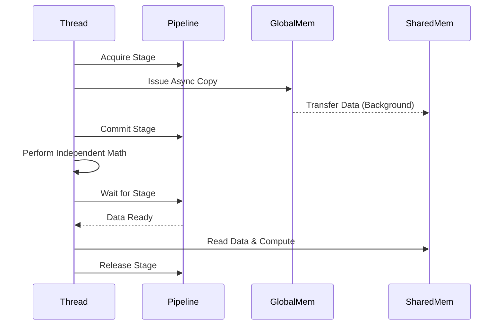

# Asynchronous Memory Copy

Introduced in NVIDIA Ampere architecture (Compute Capability 8.0), Asynchronous Memory Copy (`cp.async`) is a powerful feature that allows data to be copied from Global Memory directly to Shared Memory without passing through the Register File.

**Previous: [Memory Debugging](6_memory_debugging.md)** | **Next: [Synchronization Fundamentals](../03_synchronization/1_synchronization_basics.md)**

---

## **Why Asynchronous Copy?**

In traditional CUDA architectures, loading data from global to shared memory involved two steps:
1.  **Global -> Register**: Load data into a thread's private register.
2.  **Register -> Shared**: Store data from the register into shared memory.

This approach consumes register resources and forces the thread to wait for the load to complete (unless carefully manually pipelined).

**`cp.async` (Asynchronous Copy)** bypasses the register file:
*   **Direct Path**: Data moves from L2 Cache/DRAM directly to Shared Memory.
*   **Non-Blocking**: The issue instruction returns immediately, allowing the thread to perform other work (e.g., math) while data is in flight.
*   **Reduced Register Pressure**: Frees up registers for computation.

---

## **The Pipeline Mechanism**

Asynchronous copies are managed using a **Pipeline** object. The pipeline tracks the status of in-flight memory operations using a multi-stage synchronization mechanism.

### **Pipeline Stages**
1.  **Acquire**: Reserve a spot (stage) in the pipeline for a new batch of copies.
2.  **Copy**: Issue asynchronous copy commands (`cuda::memcpy_async` or `cp.async` PTX).
3.  **Commit**: Mark the end of the current batch of copies.
4.  **Wait**: Block execution until a specific previous stage is complete.
5.  **Release**: Free the stage after consuming the data.

### **Visualizing the Pipeline**



---

## **Implementation with C++ (`cuda::pipeline`)**

Modern CUDA (11.0+) provides the `cuda::pipeline` class in `<cuda/pipeline>` (or `<cuda_pipeline.h>`) to manage these operations safely.

### **Key API Functions**

*   `cuda::make_pipeline()`: Creates a pipeline object.
*   `pipe.producer_acquire()`: Prepares the pipeline for new copy commands.
*   `cuda::memcpy_async(dst, src, size, pipe)`: Issues the copy.
*   `pipe.producer_commit()`: Finalizes the batch.
*   `pipe.consumer_wait()`: Waits for completion.

### **Code Example**

Below is a simplified loop demonstrating the pattern. For a full compilable example, see `src/02_memory_hierarchy/AsyncCopyDemo.cuh`.

```cpp
#include <cuda/pipeline>

__global__ void async_pipeline_kernel(int* global_data, int* result) {
    extern __shared__ int smem[];

    // Create a pipeline object for the current thread
    cuda::pipeline<cuda::thread_scope_thread> pipe = cuda::make_pipeline();

    // Loop over tiles
    for (int i = 0; i < N; i += TILE_SIZE) {
        // 1. Acquire a stage
        pipe.producer_acquire();

        // 2. Issue async copies
        // Each thread copies its part of the tile
        cuda::memcpy_async(&smem[threadIdx.x], &global_data[i + threadIdx.x],
                           sizeof(int), pipe);

        // 3. Commit the stage
        pipe.producer_commit();

        // 4. Wait for the copy to finish
        pipe.consumer_wait();

        // 5. Compute on the data (now safe in shared memory)
        __syncthreads(); // Ensure all threads see the data
        result[i + threadIdx.x] = smem[threadIdx.x] * 2;

        // 6. Release the stage
        pipe.consumer_release();
        __syncthreads();
    }
}
```

---

## **Requirements & Best Practices**

### **Hardware Requirements**
*   **Compute Capability 8.0+** (NVIDIA Ampere, Hopper, Blackwell).
*   On older hardware, these functions fall back to synchronous copies, offering no performance benefit.

### **Performance Tips**
*   **Multi-Stage Pipelining**: Use multiple buffers in shared memory (double buffering or circular buffering) to completely hide memory latency. While one buffer is filling (Async Copy), the GPU computes on the previously filled buffer.
*   **Warp Efficiency**: `cp.async` instructions are most efficient when all threads in a warp issue copies.
*   **Alignment**: Ensure source and destination pointers are aligned (typically to 16 bytes) for maximum throughput.

## **Related Resources**
*   **[Async Copy Demo Code](../src/02_memory_hierarchy/AsyncCopyDemo.cuh)** - Full implementation.
*   **[Shared Memory](3_shared_memory.md)** - Understanding shared memory banks and conflicts.
