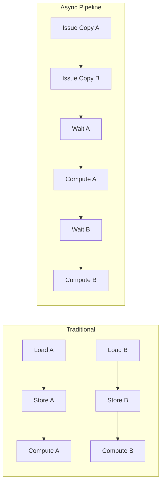

# Asynchronous Memory Copy

Introduced in NVIDIA Ampere (Compute Capability 8.0), **Asynchronous Memory Copy** (`cp.async`) is a hardware feature that allows copying data from Global Memory directly to Shared Memory without using the register file as an intermediate buffer.

**Previous: [Memory Debugging](6_memory_debugging.md)** | **Next: [Synchronization Fundamentals](../03_synchronization/1_synchronization_basics.md)**

---

## **Why Asynchronous Copy?**

Traditional global-to-shared loads involve the register file:
1.  Load data from Global Memory to Register.
2.  Store data from Register to Shared Memory.

This consumes:
-   **Registers**: Increasing register pressure.
-   **Instructions**: Requires separate load/store instructions.
-   **Latency**: The thread must wait for the load to complete before storing.

**`cp.async` bypasses the register file**, moving data directly from L2 Cache/Global Memory to Shared Memory. This allows the SM to issue the copy instruction and immediately proceed to other independent work (compute), effectively hiding memory latency.

---

## **The Pipeline Pattern**

The primary use case for `cp.async` is the **Multi-Stage Pipeline**. While one stage of data is being computed, the next stage is being fetched asynchronously.



---

## **Implementation with C++ (cuda::pipeline)**

Modern CUDA (11.0+) provides the `cuda::pipeline` primitive (in `<cuda/pipeline>`) to manage asynchronous copies safely.

### **Basic Pipeline Example**

```cpp
#include <cuda/pipeline>

__global__ void pipeline_kernel(int* global_in, int* global_out) {
    extern __shared__ int s_data[];

    // Create a pipeline object
    cuda::pipeline<cuda::thread_scope_thread> pipe = cuda::make_pipeline();

    // 1. Issue Copy (Producer)
    pipe.producer_acquire();
    cuda::memcpy_async(&s_data[threadIdx.x], &global_in[threadIdx.x], sizeof(int), pipe);
    pipe.producer_commit();

    // 2. Compute something else while copy happens...

    // 3. Wait for Copy (Consumer)
    pipe.consumer_wait(); // Wait for all pending stages

    // 4. Use Data
    int val = s_data[threadIdx.x];
    global_out[threadIdx.x] = val * 2;

    // 5. Release
    pipe.consumer_release();
}
```

### **Multi-Stage Buffering**

For maximum efficiency, use multiple buffers in shared memory. While computing on Buffer A, load into Buffer B.

```cpp
// Pseudocode for a 2-stage pipeline
for (int i = 0; i < N; i += BLOCK_SIZE) {
    // Stage 1: Issue next copy
    pipe.producer_acquire();
    cuda::memcpy_async(next_buffer, global_ptr + offset, size, pipe);
    pipe.producer_commit();

    // Stage 2: Wait for previous copy
    pipe.consumer_wait();

    // Stage 3: Compute on current buffer
    compute(current_buffer);

    // Release
    pipe.consumer_release();

    // Swap buffers
    swap(current_buffer, next_buffer);
}
```

---

## **Full Example**

See `src/02_memory_hierarchy/AsyncCopyDemo.cuh` for a complete, compilable example using `cuda::pipeline`.

### **Requirements**
-   **Hardware**: Compute Capability 8.0+ (NVIDIA Ampere, Hopper, Blackwell).
-   **Compiler**: CUDA 11.0+.
-   **Compilation**: `nvcc -arch=sm_80 ...`

---

## **Performance Tips**

1.  **Loop Unrolling**: Unroll loops to allow the compiler to schedule more async copies in flight.
2.  **Batching**: Issue multiple `cp.async` instructions before committing a stage (`producer_commit`).
3.  **L2 Cache**: `cp.async` is most effective when data is resident in L2 cache. Ensure high cache hit rates for maximum throughput.
4.  **Shared Memory Banks**: Standard bank conflict rules still apply to the destination address in shared memory.

---

## **Related Guides**

-   **[Shared Memory](3_shared_memory.md)**: Understanding shared memory layout.
-   **[Streams & Concurrency](../04_streams_concurrency/1_stream_fundamentals.md)**: Hiding latency at the grid level.
