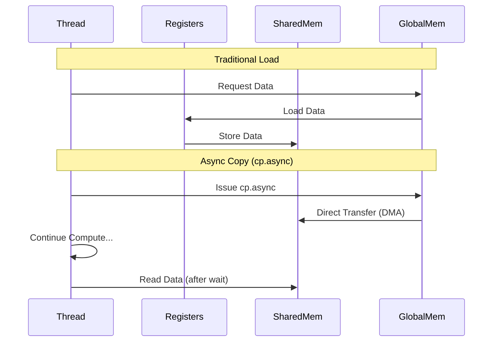

# Asynchronous Memory Copy

**Asynchronous Memory Copy** (`cp.async`), introduced in Compute Capability 8.0 (Ampere), allows for loading data from Global Memory directly into Shared Memory without intermediate register usage. This is a critical optimization for memory-bound kernels and deep learning workloads.

**Previous: [Memory Debugging](6_memory_debugging.md)** | **[Return to Index](1_cuda_memory_hierarchy.md)**

---

## Why Asynchronous Copy?

Traditional loads follow a **Load-Store** pattern:
1.  Load data from Global Memory to a Register.
2.  Store data from the Register to Shared Memory.
3.  Synchronize (`__syncthreads()`).

This consumes register bandwidth and increases latency.

**`cp.async` bypasses the register file:**
1.  Initiate a copy from Global Memory to Shared Memory.
2.  The hardware handles the transfer in the background.
3.  The thread can continue computing (latency hiding).
4.  Wait for the copy to complete only when data is needed.

## `cuda::pipeline` Interface

CUDA C++ provides the `cuda::pipeline` interface (in `<cuda/pipeline>`) to manage asynchronous copies safely and easily.

### Key Concepts

*   **Producer-Consumer Model**: The thread acts as a producer (issuing copies) and a consumer (using the data).
*   **Stages**: Data processing is often divided into stages in a pipeline loop.
*   **Acquire/Commit/Wait**:
    *   `producer_acquire()`: Reserve space in the pipeline.
    *   `memcpy_async()`: Issue the copy command.
    *   `producer_commit()`: Mark the end of a batch of copy commands.
    *   `consumer_wait()`: Wait for a specific batch to complete.
    *   `consumer_release()`: Signal that data has been consumed.

## Implementation Example

See `src/02_memory_hierarchy/AsyncCopyDemo.cuh` for a complete implementation.

```cpp
#include <cuda/pipeline>

__global__ void async_copy_kernel(float* global_in, float* global_out, int N) {
    extern __shared__ float s_mem[];
    cuda::pipeline<cuda::thread_scope_thread> pipe = cuda::make_pipeline();

    // ... loop ...

    // 1. Submit Copy
    pipe.producer_acquire();
    cuda::memcpy_async(&s_mem[tid], &global_in[idx], sizeof(float), pipe);
    pipe.producer_commit();

    // 2. Wait for Copy
    pipe.consumer_wait();

    // 3. Compute using Shared Memory
    float val = s_mem[tid];

    // 4. Release
    pipe.consumer_release();
}
```

## Hardware Requirements

*   **Architecture**: Ampere (SM 8.0) or newer (Hopper, Blackwell).
*   **Compilation**: Must compile with `-arch=sm_80` or higher.

## Performance Impact

*   **Reduced Register Pressure**: Frees up registers for computation.
*   **Latency Hiding**: Overlaps memory transfer with independent math instructions.
*   **Bandwidth**: Can achieve near-peak Global Memory bandwidth.



## Related Topics

*   **[Shared Memory](3_shared_memory.md)**: The destination for `cp.async`.
*   **[Global Memory](2_global_memory.md)**: The source for `cp.async`.
