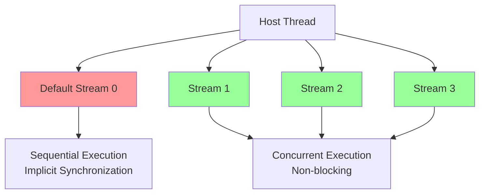

# Stream Fundamentals

CUDA streams represent ordered sequences of GPU operations that execute asynchronously with respect to the host and other streams, enabling sophisticated concurrency patterns.

**[Back to Streams & Concurrency Index](1_cuda_streams_concurrency.md)**

---

## Stream Types and Properties

### Stream Hierarchy and Characteristics

CUDA streams enable concurrent execution of operations on the GPU. Understanding stream behavior is critical for achieving maximum throughput.

The following code demonstrates the fundamentals of CUDA streams, including default stream behavior, explicit stream creation, and priority configuration.

**Code Example:** [`1_stream_fundamentals.cuh`](../src/04_streams_concurrency/1_stream_fundamentals.cuh)

### Stream Execution Model

Streams allow for FIFO ordering within a single stream, while enabling concurrency between different streams. The following diagram shows how operations overlap when using multiple streams:

```mermaid
gantt
    title Stream Concurrency - Overlapping Operations
    dateFormat X
    axisFormat %L ms

    section Stream 0
    H2D Copy 0    :s0c1, 0, 20
    Kernel 0      :s0k1, after s0c1, 40
    D2H Copy 0    :s0c2, after s0k1, 20

    section Stream 1
    H2D Copy 1    :s1c1, 10, 20
    Kernel 1      :s1k1, after s1c1, 40
    D2H Copy 1    :s1c2, after s1k1, 20

    section Stream 2
    H2D Copy 2    :s2c1, 20, 20
    Kernel 2      :s2k1, after s2c1, 40
    D2H Copy 2    :s2c2, after s2k1, 20
```

**Key Benefits:**
- Memory copies and kernels from different streams can execute concurrently
- Operations within a single stream maintain FIFO order
- Typical speedup: 2-4x for memory-bound applications

**Code Example:** [`1_stream_fundamentals.cuh`](../src/04_streams_concurrency/1_stream_fundamentals.cuh)

### Stream Management Patterns

Advanced stream management involves handling multiple streams with different priorities and assigning them to appropriate workloads.

**Code Example:** [`StreamManager.cuh`](../src/04_streams_concurrency/StreamManager.cuh)

---

## Multi-GPU Coordination

While this guide focuses on single-GPU stream concurrency, multi-GPU applications leverage streams to manage work across devices.

*   **One Context per Thread (Typical):**  Usually, a host thread manages one GPU context. To control multiple GPUs, you can use multiple host threads, or switch contexts using `cudaSetDevice()`.
*   **Streams per Device:** Each device has its own default stream and can have its own created streams.
*   **Peer-to-Peer Access:** `cudaDeviceEnablePeerAccess` allows kernels on one GPU to access memory on another.
*   **Synchronization:** `cudaStreamWaitEvent` can be used to synchronize streams across devices (if the event is created with `cudaEventInterprocess` or used within the same process context).

*(Note: A comprehensive Multi-GPU guide is planned for a future update.)*

---

## Nsight Debugging Tips

- Use **Nsight Systems** to visualize:
  - Stream timelines
  - Overlap of memcopy and kernels
- Identify serialization caused by:
  - Shared resources
  - Host sync calls (`cudaDeviceSynchronize()`)
