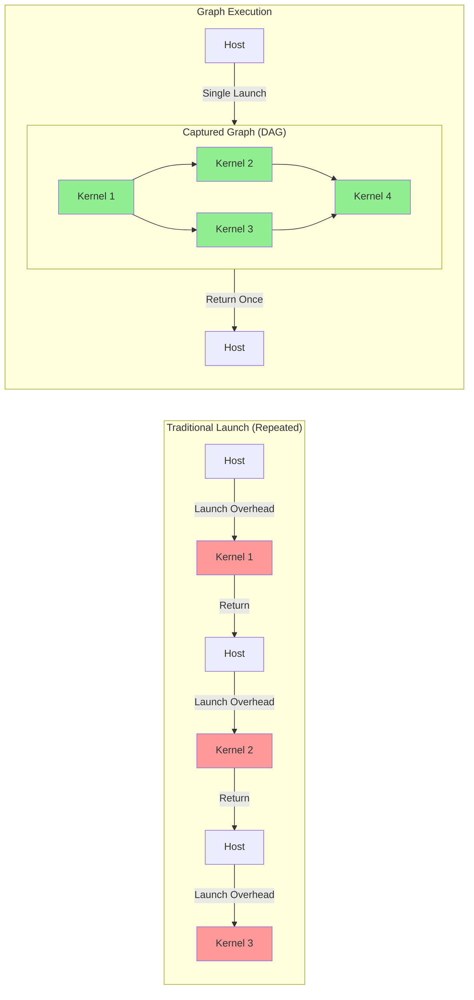
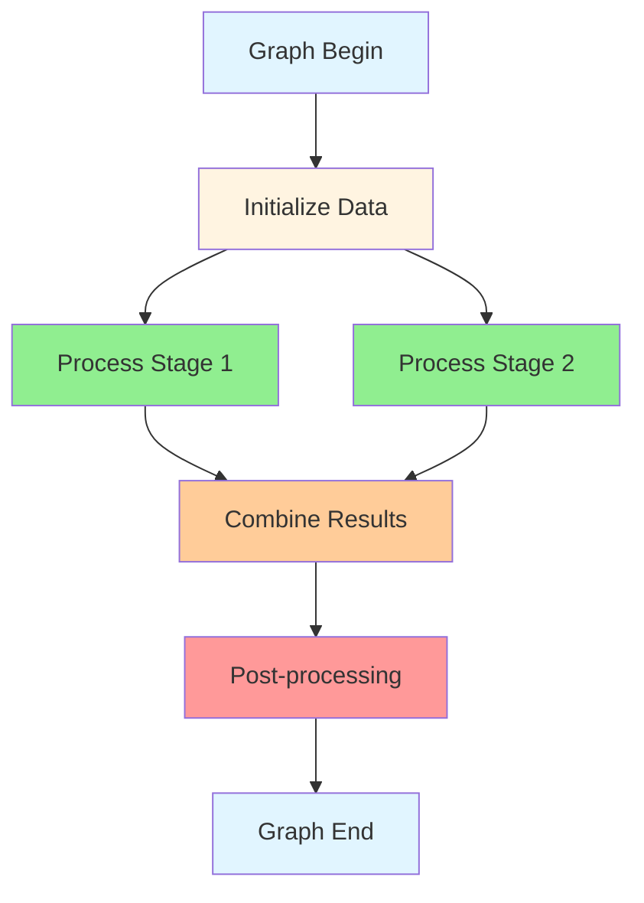

# CUDA Graphs Deep Dive

CUDA Graphs represent a paradigm shift from dynamic kernel launches to static execution graphs, enabling dramatic performance improvements for repetitive workloads by reducing launch overhead and enabling advanced optimizations.

**[Back to Streams & Concurrency Index](1_cuda_streams_concurrency.md)**

---

## Graph Fundamentals and Architecture

CUDA Graphs capture sequences of GPU operations into a static directed acyclic graph (DAG), allowing the CUDA runtime to optimize execution and minimize overhead.

### Traditional vs Graph Execution

**Benefits:**
- **Reduced Overhead**: Single launch for entire workflow (~10-50x less overhead)
- **Optimized Execution**: Runtime can analyze and optimize entire graph
- **Better Concurrency**: Dependencies explicitly defined, enables maximum parallelism

### Graph Structure Example

### Comprehensive Graph Management System

**Code Example:** [`GraphManager.cuh`](../src/04_streams_concurrency/GraphManager.cuh)

## Advanced Graph Patterns and Optimization

### Dynamic Graph Updates and Parameter Modification

Graphs can be updated with new parameters or kernel arguments without rebuilding the entire graph structure.

**Code Example:** [`AdvancedGraphPatterns.cuh`](../src/04_streams_concurrency/AdvancedGraphPatterns.cuh)

## Production Graph Optimization Strategies

### Enterprise-Grade Graph Management

Optimizing execution order and batching graphs can lead to further performance gains in production environments.

**Code Example:** [`ProductionGraphOptimizer.cuh`](../src/04_streams_concurrency/ProductionGraphOptimizer.cuh)
